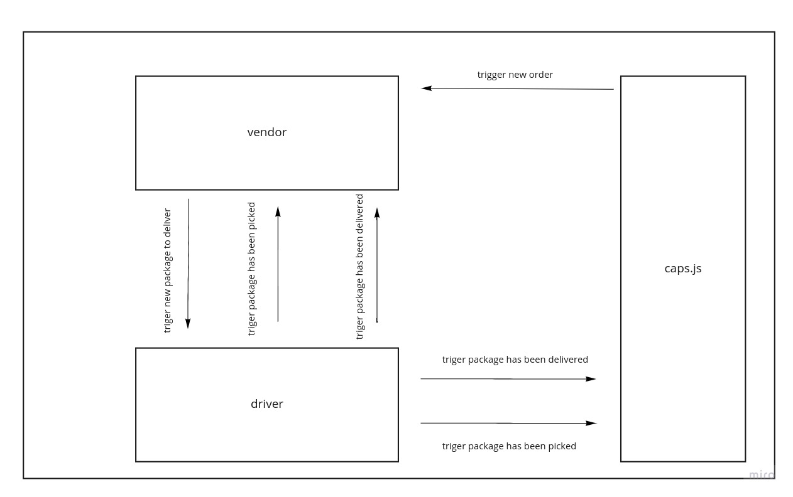
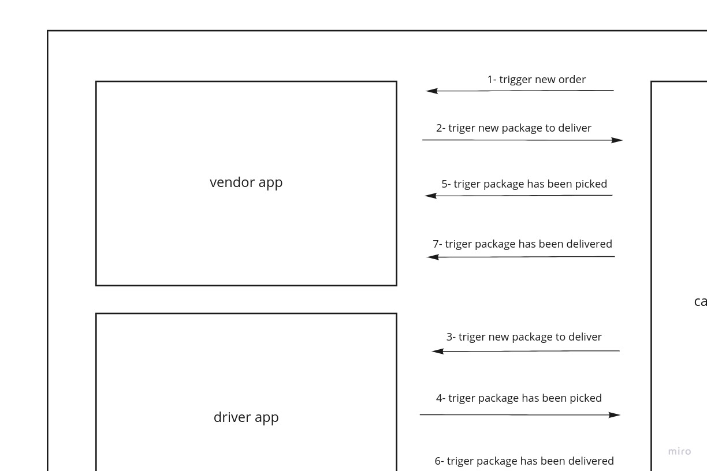

# Event Driven Applications
We will build an application for a company called CAPS - The Code Academy Parcel Service. In this sprint, we’ll build out a system that emulates a real world supply chain. CAPS will simulate a delivery service where vendors (such a flower shops) will ship products using our delivery service and when our drivers deliver them, be notified that their customers received what they purchased.

# Phase 1
## Requirements
In this phase, our goal is to setup a system of events and handlers, with the intent being to change out the eventing system as we go, but keeping the handlers themselves largely the same. The task of “delivering a package” doesn’t change (the handler), even if the mechanism for triggering that task (the event) does.

The following user/developer stories detail the major functionality for this phase of the project.

- As a vendor, I want to alert the system when I have a package to be picked up
- As a driver, I want to be notified when there is a package to be delivered
- As a driver, I want to alert the system when I have picked up a package and it is in transit
- As a driver, I want to alert the system when a package has been delivered
- As a vendor, I want to be notified when my package has been delivered

**And as developers**, here are some of the development stories that are relevant to the above

- As a developer, I want to use industry standards for managing the state of each package
- As a developer, I want to create an event driven system so that I can write code that happens in response to events, in real time

## UML

## How to use the app
From terminal go inside project's folder then run this command:
`node index.js`

# Phase 2
## Requirements
In this phase, we’ll be spreading the functionality of our CAPS application into multiple applications, so that users on different computers and connections can continue to communicate in real time as packages are prepared, picked up, and delivered.

The core functionality we’ve already built remains the same. The difference in this phase is that we’ll be using multiple applications to raise and listen for the events. The majority of the user stories remain unchanged, but there’s a difference in how we deal with the events.

## UML

## How to use the app
To use this app you need to open three terminals in your device then run one comand in each terminal.  
In the first terminal go to caps folder then type the command `node caps.js`.  
In the second terminal go to vendor folder then type the command `node vendor.js`.  
In the third terminal go to caps driver then type the command `node driver.js`